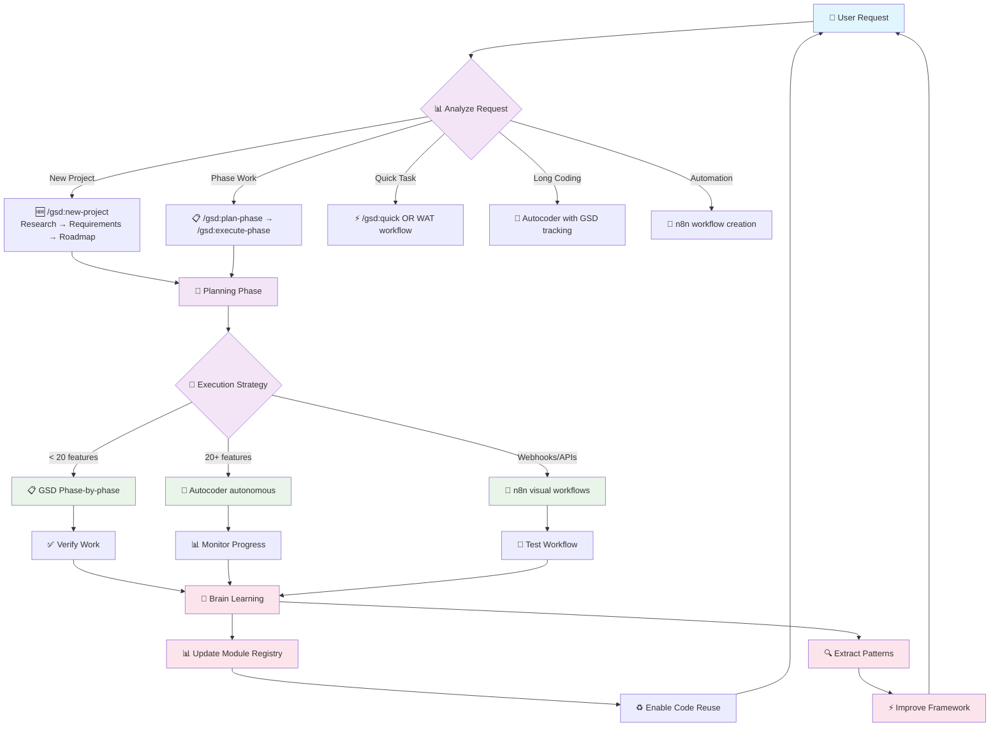
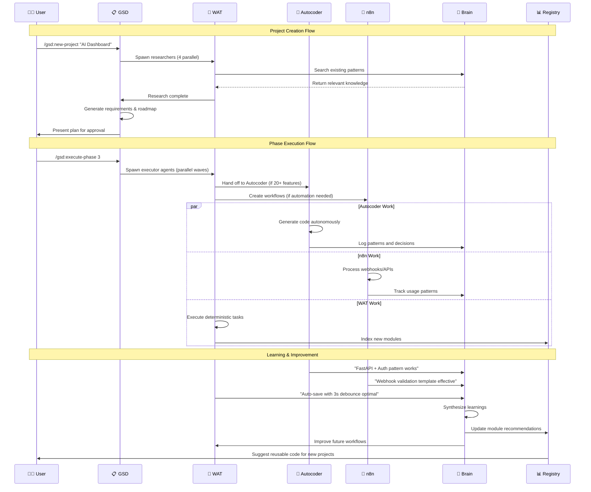
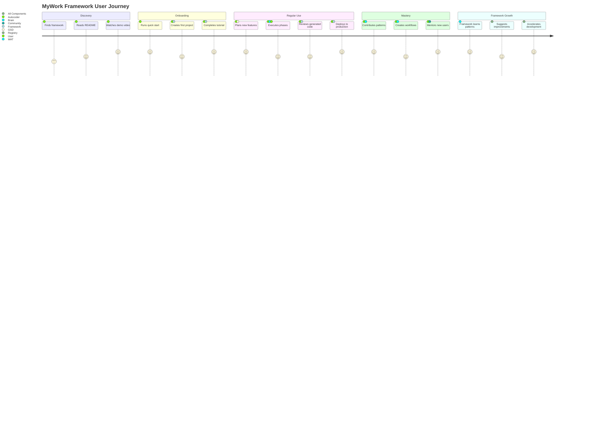

# MyWork Framework - Architecture Overview

## 🏗️ System Architecture

MyWork is built on a 3-layer architecture that separates concerns and enables powerful AI-driven development:

```mermaid
graph TB
    subgraph "🧠 USER LAYER"
        USER[👨‍💻 Developer]
        IDEA[💡 Project Idea]
    end

    subgraph "📋 LAYER 1: GSD (Get Shit Done)"
        GSD_NEW[🆕 /gsd:new-project]
        GSD_PLAN[📝 /gsd:plan-phase]
        GSD_EXEC[⚡ /gsd:execute-phase]
        GSD_VERIFY[✅ /gsd:verify-work]

        GSD_NEW --> GSD_PLAN --> GSD_EXEC --> GSD_VERIFY
    end

    subgraph "🔄 LAYER 2: WAT (Workflows/Agents/Tools)"
        subgraph "2A: Workflows"
            WAT_WORKFLOWS[📄 Markdown SOPs<br/>• create_n8n_workflow.md<br/>• use_autocoder.md<br/>• session_handoff.md]
        end

        subgraph "2B: Agents"
            WAT_AGENTS[🤖 AI Decision-Makers<br/>• Read workflows<br/>• Execute tools<br/>• Handle failures]
        end

        subgraph "2C: Tools"
            WAT_TOOLS[🛠️ Python Scripts<br/>• mw.py (unified CLI)<br/>• brain.py<br/>• health_check.py<br/>• autocoder_api.py]
        end
    end

    subgraph "🚀 LAYER 3: AUTOMATION ENGINES"
        AUTOCODER[🤖 Autocoder<br/>Long-running<br/>autonomous coding]
        N8N[🔗 n8n Workflows<br/>Visual automation<br/>2,709 templates]
        INTEGRATIONS[🔌 Integrations<br/>GitHub, Vercel<br/>Various APIs]
    end

    subgraph "🧠 INTELLIGENCE LAYER"
        BRAIN[🧠 Brain<br/>Knowledge vault<br/>Auto-learning]
        REGISTRY[📊 Module Registry<br/>Code indexing<br/>Reusable patterns]
        ANALYTICS[📈 Analytics<br/>Usage tracking<br/>Pattern analysis]
    end

    %% User Flow
    USER --> IDEA
    IDEA --> GSD_NEW

    %% GSD to WAT
    GSD_PLAN --> WAT_WORKFLOWS
    GSD_EXEC --> WAT_AGENTS
    WAT_AGENTS --> WAT_TOOLS

    %% WAT to Automation
    WAT_TOOLS --> AUTOCODER
    WAT_TOOLS --> N8N
    WAT_TOOLS --> INTEGRATIONS

    %% Intelligence Layer Connections
    WAT_TOOLS <--> BRAIN
    WAT_TOOLS <--> REGISTRY
    GSD_EXEC --> ANALYTICS
    AUTOCODER --> ANALYTICS
    N8N --> ANALYTICS

    %% Feedback Loop
    ANALYTICS --> BRAIN
    BRAIN --> WAT_WORKFLOWS
    REGISTRY --> WAT_TOOLS

    classDef userLayer fill:#e1f5fe
    classDef gsdLayer fill:#f3e5f5
    classDef watLayer fill:#e8f5e8
    classDef autoLayer fill:#fff3e0
    classDef intLayer fill:#fce4ec

    class USER,IDEA userLayer
    class GSD_NEW,GSD_PLAN,GSD_EXEC,GSD_VERIFY gsdLayer
    class WAT_WORKFLOWS,WAT_AGENTS,WAT_TOOLS watLayer
    class AUTOCODER,N8N,INTEGRATIONS autoLayer
    class BRAIN,REGISTRY,ANALYTICS intLayer
```

## 🔄 Data Flow & Decision Tree



## 🧩 Component Interaction



## 🎯 User Journey Map



## 🏛️ Architecture Principles

### 1. **Separation of Concerns**
- **GSD**: What to build (orchestration, planning)
- **WAT**: How to build it (execution, tools)
- **Automation**: Scale the building (AI agents, workflows)

### 2. **Progressive Enhancement**
- Start simple (GSD phases)
- Add automation when beneficial (Autocoder for 20+ features)
- Scale with visual tools (n8n for complex integrations)

### 3. **Continuous Learning**
- **Brain** captures what works
- **Registry** indexes reusable code
- **Analytics** measures effectiveness

### 4. **Human-AI Collaboration**
- AI handles repetitive tasks
- Human provides direction and judgment
- Clear handoff points between human and AI work

### 5. **Modularity & Reuse**
- Everything is a reusable module
- Clear interfaces between components
- Plugin architecture for extensions

## 🔧 Technical Stack

| Layer | Technologies | Purpose |
|-------|-------------|---------|
| **Orchestration** | Python, Bash, Markdown | GSD workflow management |
| **Execution** | Python tools, AI agents | Task automation |
| **Code Generation** | Autocoder, OpenAI API | Autonomous coding |
| **Workflow Automation** | n8n, JavaScript, APIs | Visual automation |
| **Data Storage** | SQLite, JSON, Markdown | State and knowledge |
| **Intelligence** | Vector embeddings, Analytics | Learning and patterns |
| **Deployment** | Vercel, GitHub Actions | Production deployment |

## 📊 Performance Characteristics

- **Project Setup**: 2-5 minutes (vs 30-60 min manual)
- **Feature Development**: 60-80% faster than manual coding
- **Code Quality**: Consistent patterns, auto-testing
- **Learning Curve**: 1-2 days to productivity
- **Maintenance**: Self-healing and auto-updating

---

*Next: [Quickstart →](../quickstart.md) | [Tutorials →](../tutorials/index.md) | [CLI Reference →](../api/mw-cli.md)*
